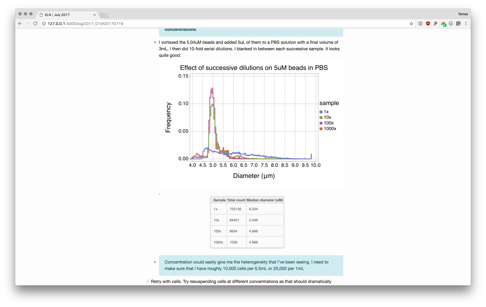

# 📓 jekyll-lab-notebook

Supercharge your electronic lab notebook!

This is a full-featured jekyll theme that lets you quickly write markdown
notebook entries and will create a great HTML website that you can run locally
to view all your hard work. It's hackable to its core so you can tweak it to
your heart's desire. Add pages, change layouts, add cool jekyll plugins,
whatever; think of this as your springboard.

## Features

- Take simple markdown notes in your favorite text editor (I recommend [Atom](https://atom.io/))
- Easily embed images, CSVs, or PDFs in your protocols/logs/wherever
- Interactive calendar to show you when you had log entries
- Enter your log entries chronologically, but then tag them so they show up with other entries on the same project (Multi-project tags supported too!)
- Add highlighted sections (note or thought bubbles) to draw attention to important things

## Installation and Usage

See the [eln-example](https://github.com/tlnagy/eln-example) repo.

## Contributing

This project is split into two main reports

- The one you're on, which is where all the layout and design stuff happens
- The [plugins](https://github.com/tlnagy/jekyll-lab-notebook-plugins) repo, this where the heavy lifting happens.

Bug reports and pull requests are welcome on GitHub at <https://github.com/tlnagy/jekyll-lab-notebook> and at <https://github.com/tlnagy/jekyll-lab-notebook-plugins>. This project is intended to be a safe, welcoming space for collaboration, and contributors are expected to adhere to the [Contributor Covenant](http://contributor-covenant.org) code of conduct.

## Development

TODO

## License

The theme is available as open source under the terms of the [MIT License](https://opensource.org/licenses/MIT).
